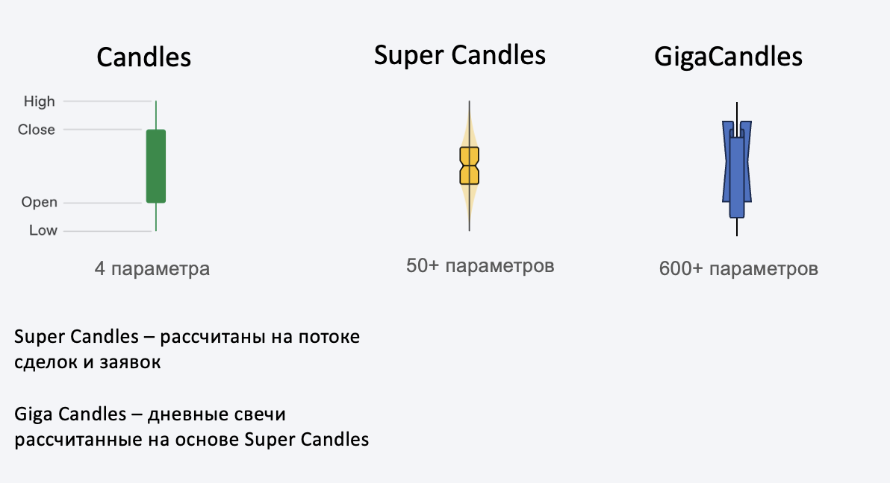
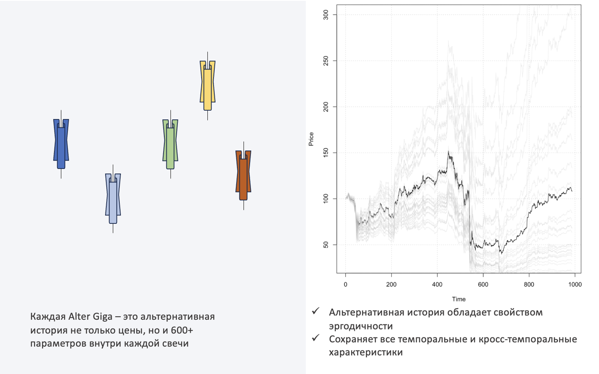
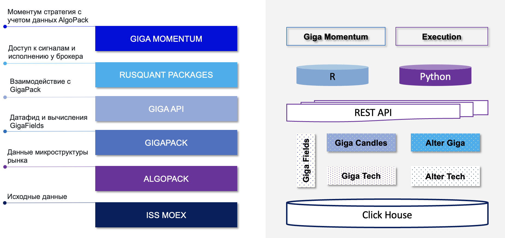
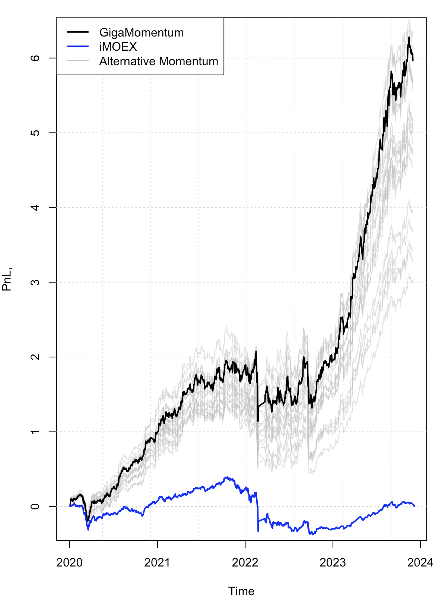

# GigaPack  <a href='https://gigapack.rusquant.io'></a>

```shell
Сервис создан в рамках Хакатона «GoAlgo» от Московской Биржи
по созданию решений для инвесторов на рынке акций
```

GigaPack представляет из себя вычислительный слой над данными Алгопака и дает доступ инвесторам к агрегированной микроструктуре фондового рынка и ее альтернативной истории.

###  Ключевые проблемы алготрейдера

+ наличие только одной реализации процесса колебаний цен финансового актива
+ однообразие используемой информации для принятия инвестиционных решений
+ при постоянно растущем числа фичей, оверфит "стратегии" превращается в дикую головную боль

### Решение проблемы: сервис GigaPack

Предлагаемый инвестиционный сервис ориентирован на аудиторию алготрейдеров и состоит из трех главных элементов, каждый из которых доступен по API:

+ Консолидатор рыночных данных и данных AlgoPack в объект, который мы назвали GigaCandles
+ Стандартные технические индикаторы для удобства пользования
+ И, ключевой элемент: синтетические рыночные данные (AlterGiga)

**В базовой структуре решения имеются следующие элементы:**

* **Giga Candles** - это агрегированные свечи (на основе Super Candles), которые имеют более 600+ характеристик на каджую дневную свечу

* **Giga Tech** - это заранее посчитанные данные по техническому анализу по 100+ индикаторам

* **Giga Fields** - это список доступных характеристик свечей связанных как с техническим анализом, так и с микроструктурными данными

*  **Alter Giga и AlterTeсh** - это альтернативные данные основанные на технологии [блок ресемплинга](https://www.researchgate.net/publication/46515745_Maximum_Entropy_Bootstrap_for_Time_Series_The_meboot_R_Package)

*  **Giga Momentum** - пример алгоритмической системы, которая использует в принятии решений как технические данные, так и микроструктурные характеристики от AlgoPack (через слой GigaPack). Данная торговая система проходит все стадии проверки на out-of-sample и альтернативную историю от AlterGiga: [подробное исследование](https://rpubs.com/arbuzov/momentum). Написан [скрипт](https://github.com/arbuzovv/GigaPack/blob/main/src/GigaMomenumExecutor.R) испольняющий на ежедневной основе сигналы данной алгоритмической системы

*  **AI bots** - примеры торговых алгоритмов на основе достижений машинного обучения, которые показывают, то как легко торговые роботы могут переобучаться. Большинство AI алгоритмов легко фитят рынок на истории и показывают 5-10 коэффициент Шарпа (при большом объеме времени и параметров, точно найдем - шарп не 10, но близко). Некоторые бумаги (в силу случайности) даже способны проходить традиционный out of sample. С использованием данных, Alter Giga и AlterTeсh можно выявлять такие случайности и не пропускать такие алгоритмы в живую торговлю.

   + **ML, Random Forest** - торговый робот в котором мы использовали ограниченный набор известных показателей и 5 показателей из AlgoPak,
загрузили все параметры в RandomForestRegressor и безжалостно зафитили in-sample до откровенно стыдного уровня и далее с использованием AlterGiga проверили, что так делать нельзя: [подробное исследование](https://rpubs.com/arbuzov/overfitting_ml)
   + **NN, LSTM** - мы также ради любопытства зафитили LSTM нейронную сеть (число параметров перевалило за 5 миллионов, при наличии всего 900 торговых дней) с аналогичным результатом;
некоторые инструменты при этом, условно успешно переживают out-of-sample период: accuracy > 50%: [подробное исследование](https://github.com/arbuzovv/GigaPack/blob/main/AI_LSTM_NN.ipynb)

### GigaCandles - агрегированные на дни свечи SuperCandles

Прежде чем переходить к агрегированию внутредневных данных, мы сперва приводим данные из нерегулярных в регулярные и заполняем образовавшиеся пропуски исходя из здравого смысла. Преобразование внутредневных характеристик СуперСвечей может быть проведено разными способомами, например:

+ Вычисление средней, медианы, стандартного отклонения, skew и т.д.
+ Вычисление автокорреляционных характеристик внутри дня (ACF(1),ACF(2))
+ Вычисление прочих характеристик нормализующих данных показателей

Подробнее процесс регуляризации и преобразования данных описан в файле [GigaCandles.R](https://github.com/arbuzovv/GigaPack/blob/main/src/GigaCandles.R)

Таким образом после преобразований мы получаем на каждый день количество характеристик в суперсвечах * количество преобразований (сейчас это 10 штук). На текущем этапе для каждой свечи имеется более 600+ характеристик



### AlterGiga - альтернативные свечи: суть подхода

В связи с тем, что мы переходим к более крупному тайфрему мы сталкиваемся с недостатком наблюдений и естественно уменьшается статистическая значимость в разрабатываемых стратегиях. Для преободаления этого ограничений мы используем генерацию альтернативных ценовых траекторий и гигасвечей имеющих другие варианты развития событий, но сохраняющих временнный статистические закономерности.  

Мы предлагаем воспользоваться нашим сервисом генерации синтетических данных по любому финансовому инструменту.

Ключевые особенности нашего подхода:

+ **Сохранение зависимостей**: все темпоральные и кросс-темпоральные характеристики временных рядов полностью сохраняются, как линейные, так и любые иные;
+ **Корреляция с исходным рядом**: практически 100%, будет снижаться при роста числа блоков разбиения для бутстрэпа. Размер блока определяется пользователем и зависит от характеристик (памяти) стратегии;
+ **Эргодическая гипотеза**: сгенеренные сервисом альтернативные реализации цен, например SBER, обладают уникальным свойством - их средние показатели в точности соответствуют исходному ряду. По сути, речь идет о доступе к "параллельным вселенным", где торгуется выбранный финансовый инструмент;



Сервис рекомендуется использовать одним из двух способов:

+ По итогам разработанной стратегии, сгенерить как минимум 10 синтетических траекторий (как аппроксимация 10 децилей), на которых как на дополнительном out of sample прогнать стратегию. При существенной разнице между исходным Шарпом и средним распределения из 10 Шарпов по синтетическим траекториям - красный флаг.
+ Использовать синтетические данные изначально - несколько разных генераций при необходимости - для разработки стратегии. По итогам такого подхода использовать настоящую реализацию цены как out of sample период в полном объеме.

Ограничения:

+ Cервис лучше всего подходит для стратегий, построенных так или иначе из цен и их производных. Фундаментальные данные требуют отдельного сервиса и решения, куда более сложного, чем то, что предлагается;
требуется определенная осторожность при бутстрепе многомерных векторов, состоящих не только из цен закрытия: важно проверять полученные синтетические данные на сохранения внутри-векторных соотношений;
и главное: даже безграниченый объем синтетических данных не является гарантией от оверфита! не теряйте голову!

### Архитектура решения
GigaPack имеет микросервисную архитектуру и использует технологии бессерверных вычислений на Yandex Cloud. Исторические данные по **Giga Candles** и **Giga Tech** являются предрассчитаными и хранятся в ClickHouse, c обновлением данных каждые 5 минут в течение последного торгового часа на Московской Бирже. Некоторые данные, такие как **Alter Giga и AlterTeсh** считаются "на лету", поэтому при большом количестве симуляций могут достаточно долго выдавать результат. 

Для взаимодействия с сервисом GigaPack были разработаны/доработаны: 
+ [REST API](http://swagger.rusquant.io) сервис для взаимодействия с любым языком программирования (создан)
+ [rusquant](https://github.com/arbuzovv/rusquant/) библиотека для R (доработан)
+ [pyrusquant](https://github.com/arbuzovv/pyrusquant) библиотека для Python (создан)
+ [вэб портал на Shiny](http://gigapack.shinyapps.io/main//) - позволяющий визуализировать гигасвечи и разнообразные микроструктурные эффекты (создан)



### Giga Momentum - торговая стратегия на основе моментума и данных GigaPack
Для целей исследования была разработана хорошо изученная в академической среде торговая стратегия моментума (на основе индикатора стохастика) и в ней учтен дисбаланс из потока заявок. [Подробнее про исследование.](http://rpubs.com/arbuzov/momentum)
Для ежедневного исполнения сигналов выдаваемых торговой стратегией был разработан скрипт [GigaMomenumExecutor.R](https://github.com/arbuzovv/GigaPack/blob/main/src/GigaMomenumExecutor.R), который позволяет подключиться к одному из 3 брокеров (Алор, Финам, Тинькофф) и исполнить заявки приводящие к исполнению необходимых сигналов. Кроме того, для контроля исполнения сделок, в этом скрипте есть настройка телеграмм бота, который позволяет высылать уведомления о ежедневных сигналах.



**Проверка на оверфитинг - сравнение Giga Momentum с AI алгоритмами**
Проверка на оверфитинг стратегии - нормальная история, когда реальная траектория не отличается от виртуальной цены (картинка слева). Таким образом стратегия Giga Momentum проходит проверку на альтернативной истории, что свидетельствует о том, что ее можно использовать в живой торговле
В случае когда мы сталкиваемся с оверфитингом стратегий как в уже упомянутой выше [ML стратегии](https://rpubs.com/arbuzov/overfitting_ml), мы получаем сильное отклонение характеристик на тренировочной выборке (картинка справа).


**Имплементация торговой стратегии**
Для ежедневного исполнения скрипта [GigaMomenumExecutor.R](https://github.com/arbuzovv/GigaPack/blob/main/src/GigaMomenumExecutor.R), пользователь может:
+ разместить скрипт у себя на локальном ПК или vds и настроить расписание по вызову данного скрипта
+ разместить код в бессерверной функции на Yandex.Cloud и настроить расписание

### P.S. GigaPack monitor - вэб-портал для мониторинга данных GigaPack
Как дополнительной решение для тех, кто не обладает навыками программирования, с целью мониторинга данных GigaPack мы создали [вебпортал](https://gigapack.shinyapps.io/main/) позволяющий оценить динамику и структуру данных.


### Структура файлов GigaPack

+ GigaMomenum.html - торговая стратегия Giga Momentum
+ AI_RF_ML.html - вычисление характеристик торговой стратегии.
+ AI_LSTM_NN.ipynb- вычисление характеристик торговой стратегии.
+ src
   + GigaMomenumExecutor.R - алгоритм для ежедневной торговли моментум стратегией с подключением к одному из брокеров (Алор, Финам, Тинькофф)
   + GigaMomenum.R - алгоритм исследования стратегии моментум представленной в блокноте (GigaMomenum.html)
   + GigaCandles.R - скрипт преобразующий данные AlgoPack в GigaPack
   + GigaTech.R - скрипт расчитывающий 80+ технических индикаторов для GigaTech
   + AlterGiga.R - скрипт сравнивающий: реальные и альтернативные ценовые траектории, автокорреляционные свойства и корреляции

### Команда Rusquant
+ Вячеслав Арбузов - Team Lead, Architect, Quant,R
+ Владимир Пахомов - Quant, AlterGiga
+ Максим Петухов - Python, Development
